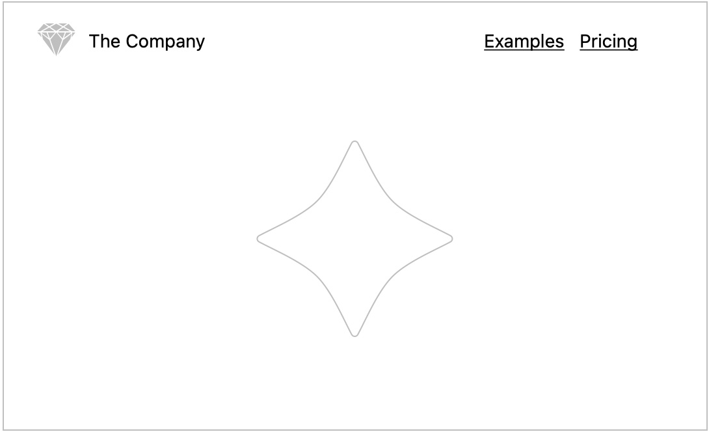
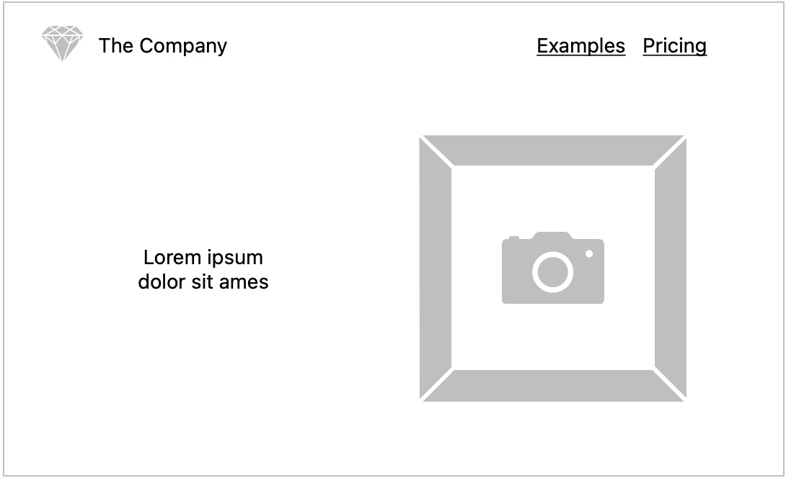
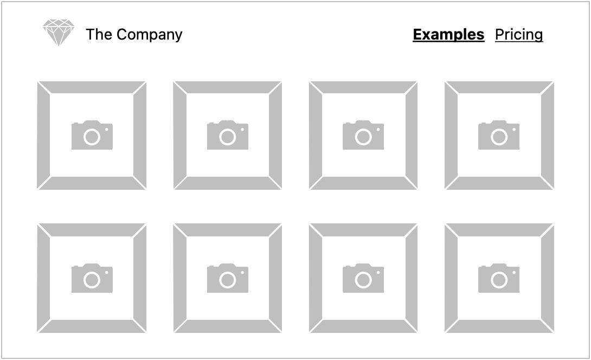
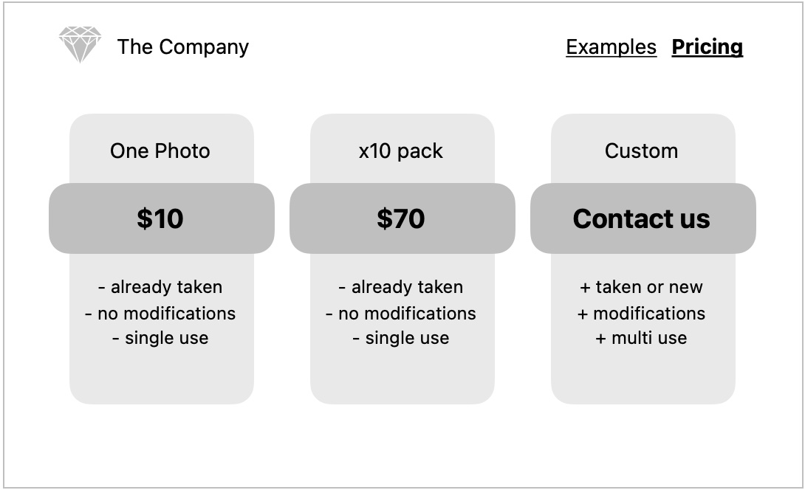
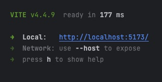

# Projekt: HTML i CSS

Waszym zadaniem jest stworzenie aplikacji webowej dla firmy fotograficznej.

## Landing page

Tzw. _landing page_ to najczęściej pierwsze co widzimy wchodząc na daną stronę internetową. 

Co taka strona powinna zawierać?

- [ ] Tytuł 

  widoczny na karcie przeglądarki

- [ ] Ikonę

  widoczną na karcie przeglądarki

- [ ] Nagłówek

  przyklejony do góry strony, zawierający:

  - [ ] logo

    może to być też ta sama ikona co na karcie przeglądarki oraz nazwa firmy lub projektu

  - [ ] linki

    służące do szybkiej nawigacji po stronie, możecie je dodać na koniec lub podczas tworzenia nowych sekcji

  

- [ ] Krótką zachętę do pozostania na stronie
  
  Często sprowadza się to do sloganu lub jednej, zwykłej frazy podsumowującej, czym zajmuje się dana firma lub czego dotyczy projekt.
  Dodatkowym elementem estetycznym może być zdjęcie lub symboliczna grafika znajdująca się obok.

  

- [ ] Ogólne informacje mówiące o tym, co możemy zaoferować
  
  W naszym przypadku będzie to siatka zdjęć z portfolio.

  

- [ ] Cennik

  Czyli jedna z kluczowych informacji dla odwiedzającego.

  

Obrazki zamieszczone powyżej to jedynie sugerowana struktura strony. Możecie dodać coś od siebie 

Zmiany zacznijcie wprowadzać w pliku [index.html](./index.html), który już został utworzony.

## Szczegóły techniczne

### Instalacja zależności

Powinniście mieć lokalnie zainstalowany `node` w wersji LTS (na ten moment v18).

Zainstalujcie biblioteki wymagane do uruchomienia projektu poleceniem w terminalu:

```shell
npm install
```

lub

```shell
pnpm install
```

### Uruchomienie aplikacji

Projekt został zainicjowany z użyciem [Vite](https://vitejs.dev).

Serwer uruchomicie poleceniem w terminalu:

```shell
npm run dev
```

lub

```shell
pnpm dev
```

Po chwili zobaczycie komunikat z linkiem, pod którym aplikacja jest dostępna. Na zrzucie poniżej jest to http://localhost:5173.



### Dodawanie zasobów lokalnych

Zarówno ikonę jak i zdjęcia możecie dodać jako zasób lokalny. W tym celu skopiujcie/przenieście taki plik do katalogu `public` w projekcie. Po uruchomieniu serwera będzie on dostępny pod adresem `http://localhost:5173/<nazwa-pliku>`, np. `http://localhost:5173/vite.svg`

Pamiętajcie, by podczas osadzania plików na stronie podać ścieżkę z pominięciem części serwera (`http://localhost:5173`), czyli np. `/html.svg`.

